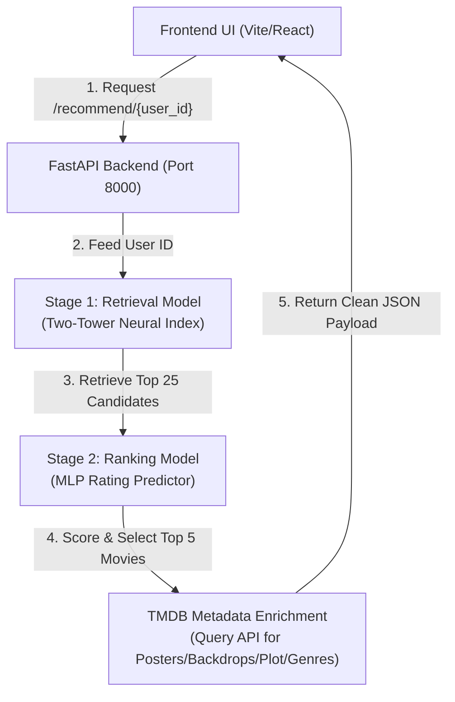

# 🎬 MovieLens Recommender System & Netflix Clone

Welcome to the end-to-end Two-Stage Movie Recommendation Platform! This repository integrates a neural deep-learning recommendation backend with a rich, interactive Netflix-style React web application.

## 🧠 System Architecture

The recommendation engine uses a standard industry-level **Two-Stage pipeline** to retrieve and rank movies dynamically in under **30ms**:



---

## 🛠 Features Completed

### 1. Two-Stage Machine Learning Pipeline
* **Stage 1: Retrieval:** Queries the pre-trained `BruteForce` index (Two-Tower retrieval neural network) to search the 1,600+ MovieLens catalog and instantly retrieve the **top 25 candidates** matching user embedding proximity.
* **Stage 2: Ranking:** A Keras/TFRS Multilayer Perceptron (MLP) trained on the 100K ratings dataset takes the user ID and candidate movie titles to predict user ratings (1-5 scale). Candidates are sorted in descending order, returning the **top 5 recommendations** for maximum quality.

### 2. Backend Enrichment (`server.py`)
* **Title Cleaning:** Helper parsed MovieLens strings (e.g. converting `"Bridges of Madison County, The (1995)"` to `"The Bridges of Madison County"`).
* **Smart Fallback Queries:** Searches TMDB with a year constraint first; if no match is found, it automatically drops the year restriction to prevent empty results.
* **Genre ID Mapping:** Translates numeric TMDB IDs into human-readable genres (e.g., Action, Sci-Fi) to render badges.
* **Asynchronous Concurrency:** Fires queries concurrently using `httpx` and `asyncio.gather` for fast loading.

### 3. Interactive Netflix-Style UI (`App.jsx` + Tailwind CSS v4)
* **Who's Watching Screen:** Netflix-style landing page containing 5 preloaded user profiles + custom ID text input.
* **Cinematic Hero Banner:** Highlights the #1 recommendation with its TMDB backdrop image, rating badge, year, overview, and play CTAs.
* **Navigation Tabs:** Fully operational tabs for **Home**, **Series** (utilizing high-fidelity TV show recommendations), **Movies** (grid view), and **My List**.
* **Profile-Specific 'My List' Persistence:** Adding movies to My List persists inside browser `localStorage` keyed by user ID, simulating genuine user accounts.
* **Instant Search Filtering:** Searching in the navigation bar matches titles, overviews, and genres in real-time, displaying a grid of search results.
* **Toast Alerts & Spinner Loading:** Fluid micro-interactions (spinning loading wheel, slide-in confirmation toasts when lists are modified).
* **Aesthetic Fixes:** Removed `drop-shadow` styles from description paragraphs to eliminate overlapping duplicate lines of text.

---

## 🚀 How to Run the Project

### 1. Run the FastAPI Backend
From the root workspace directory, launch Uvicorn with legacy Keras support:
```bash
TF_USE_LEGACY_KERAS=1 ./env/bin/uvicorn server:app --host 0.0.0.0 --port 8000 --reload
```

### 2. Run the Vite Frontend
From the `frontend/` directory, launch the Vite dev server:
```bash
npm run dev
```
Open your browser and navigate to `http://localhost:5173/` to view the platform!

---

## 📚 Recommendation Mechanism (How It Works)

The movies are fetched and sorted for each user using a **collaborative-filtering-based two-stage model pipeline**:

1. **User Embedding lookup**: When a profile is loaded, the user ID is sent to the backend. The backend maps the user ID to a 32-dimensional dense embedding vector learned during training on MovieLens interactions.
2. **Item (Movie) Retrieval**: The User Embedding is matched against all 1,600+ movie embeddings in the shared vector space. Movies that are geometrically closest (highest similarity score) are selected. We retrieve the **top 25 candidates**.
3. **Neural Rating Ranking**: To ensure the user gets recommendations they will rate highly (rather than just popular matches), we pass the (user, candidate movie) pairs into the Stage-2 Ranking Model. The MLP predicts the rating (1.0 to 5.0) that the user would assign.
4. **Sorting and Serving**: The 25 candidates are sorted by their predicted rating score. The top 5 highest-scored movies are sent to TMDB for metadata enrichment (posters, backdrops, overview, rating) and served to the user interface.
