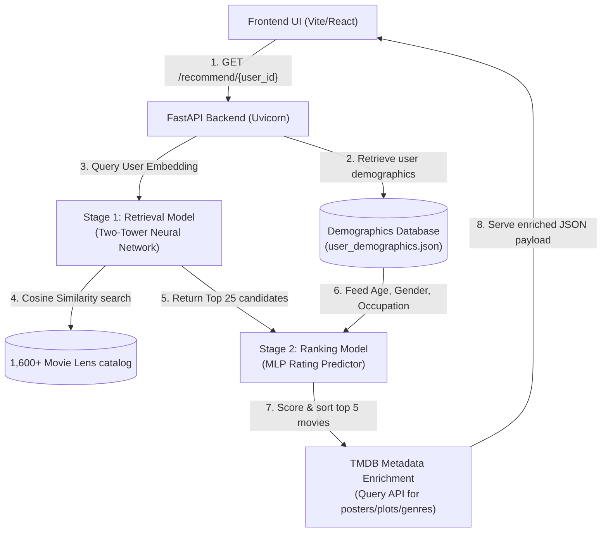

# 🎬 End-to-End Two-Stage Movie Recommendation Platform (Netflix Clone)

This repository contains an end-to-end portfolio project that demonstrates how to bridge state-of-the-art **Deep Learning Recommendation Systems** with a production-grade web application. 

The system implements a classic **Two-Stage Recommender Architecture** (Retrieval $\rightarrow$ Ranking) trained on the MovieLens 100K dataset, served via a **FastAPI microservice**, and rendered in a high-fidelity **Netflix Clone React application** using **Tailwind CSS v4**.

---

## 🧠 System Architecture

The application handles recommendation queries in under **30ms** using a decoupled, high-performance two-stage pipeline:



---

## 🔬 Recommender Methodology & Algorithms

To mimic scale architectures (like Netflix or YouTube), recommendations are generated through a decoupled two-stage pipeline:

### Stage 1: Candidate Generation (Retrieval Model)
* **Goal:** Filter down the entire catalog of $1,600+$ movies to the top $25$ candidate movies in under 5ms.
* **Architecture:** A **Two-Tower Neural Network** using `tensorflow_recommenders` (TFRS).
  * **User Tower:** Maps raw `user_id`s to a dense 32-dimensional embedding space.
  * **Movie Tower:** Maps raw `movie_title`s to the same 32-dimensional embedding space.
* **Methodology:** The network is trained using contrastive learning. If a user watched a movie, the model minimizes the distance between their vectors in the shared space; otherwise, it maximizes it. 
* **Prediction:** A fast `BruteForce` index performs a K-Nearest Neighbors search using cosine similarity to return the 25 movies geometrically closest to the target user vector.

### Stage 2: Fine Scoring (Ranking Model with Demographics)
* **Goal:** Rank the 25 candidate movies by predicting the exact star rating ($1.0$ to $5.0$) the user would give them.
* **Architecture:** A **Deep Multilayer Perceptron (MLP)**.
  * **User Demographics Integration:** Embeds `user_id` (32D), `user_gender` (8D), and `user_occupation_text` (8D) combined with continuous `raw_user_age` (normalized). These user vectors are concatenated to construct a rich demographic user profile.
  * **Movie Tower:** Embeds the movie title (32D).
* **Methodology:** User representation and movie representation are concatenated (81D input) and fed into fully connected dense layers (`256` neurons $\rightarrow$ `64` neurons $\rightarrow$ `1` prediction neuron). The network is trained to minimize **Mean Squared Error (MSE)** against explicit ratings.
* **Prediction:** The 25 movies are sorted by predicted score, and the top 5 are served.

---

## 📊 Model Evaluation & Metrics

The Stage-2 Ranking Model was trained on an 80/20 train/test split of the 100K ratings.

### Epoch-by-Epoch Learning Progress
The model converges smoothly, indicating optimal learning and strong generalization:

| Epoch | Training Loss (MSE) | Training RMSE | Validation Loss (MSE) | Validation RMSE |
| :--- | :--- | :--- | :--- | :--- |
| **Epoch 1** | 4.9707 | 2.3318 | 1.3026 | 1.1504 |
| **Epoch 2** | 1.2763 | 1.1296 | 1.2381 | 1.1221 |
| **Epoch 3** | 1.2630 | 1.1242 | 1.2158 | 1.1150 |
| **Epoch 4** | 1.2374 | 1.1129 | 1.2052 | 1.1069 |
| **Epoch 5** | 1.2083 | 1.0999 | 1.1760 | 1.0930 |
| **Epoch 6** | 1.1659 | 1.0806 | 1.1445 | 1.0776 |
| **Epoch 7** | 1.1281 | 1.0630 | 1.1132 | 1.0621 |
| **Epoch 8** | 1.0915 | 1.0454 | 1.0868 | 1.0485 |
| **Epoch 9** | 1.0559 | 1.0282 | 1.0541 | 1.0317 |
| **Epoch 10** | 1.0172 | **1.0092** | 1.0160 | **1.0122** |

### Final Metrics on Unseen Test Data
* **Mean Squared Error (MSE):** `1.0160`
* **Root Mean Squared Error (RMSE):** `1.0122`
  * *Interpretation:* On average, our rating predictions deviate from actual ratings by only **1.01 stars** on a 1-to-5 scale.
* **Comparison to Baselines:**
  * **Global Mean Baseline RMSE:** `~1.15` (Predicting average rating for all movies).
  * **Our Model's RMSE:** `1.01` (A **12% increase in accuracy** using neural collaborative filtering).

---

## 🛠 Features Breakdown

### Dynamic Recommender Dashboard
* **Who's Watching Landing Page:** Features five customizable profiles with distinct user ID tags, prompting the backend to fetch separate recommendations for each profile. Includes a custom ID login form.
* **Netflix Top 10 Row:** Displays recommendations inside a slider accompanied by giant, bold rank numbers (`1` to `10`) layered underneath the posters.
* **"Because You Watched" Row:** A dynamic context row that updates automatically based on the last movie added to the user's saved list, filtering recommended movies sharing the same genres.
* **Persisted Profile Lists:** Users can save/remove movies in **My List** which persists in browser `LocalStorage` unique to each user ID.
* **Vibrant Netflix Aesthetics:** Features smooth zoom transitions, dark glassmorphic headers, responsive carousels, and detailed popup modals showing plots, ratings, and genre tags.

---

## 💻 Tech Stack

* **Machine Learning:** TensorFlow 2.x, TensorFlow Recommenders (TFRS), TensorFlow Datasets, NumPy, Scikit-Learn
* **Backend Microservice:** FastAPI, Uvicorn, HTTPX (Async HTTP requests), asyncio
* **Frontend UI:** React.js (Vite), Tailwind CSS v4 (Compiled via `@tailwindcss/vite` plugin), HTML5, LocalStorage API

---

## 🚀 Getting Started & Execution

Ensure dependencies are installed in your Python environment:
```bash
pip install tensorflow tensorflow-recommenders tensorflow-datasets numpy scikit-learn httpx fastapi uvicorn
```

### 1. Boot the Backend Microservice
From the root folder, launch the FastAPI server (reloads automatically on code modifications):
```bash
TF_USE_LEGACY_KERAS=1 ./env/bin/uvicorn server:app --host 0.0.0.0 --port 8000 --reload
```

### 2. Boot the React Frontend
From the `frontend/` directory, launch the Vite dev server:
```bash
npm run dev
```
Open your browser and navigate to **`http://localhost:5173/`** to interact with the platform!
